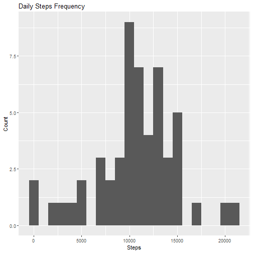
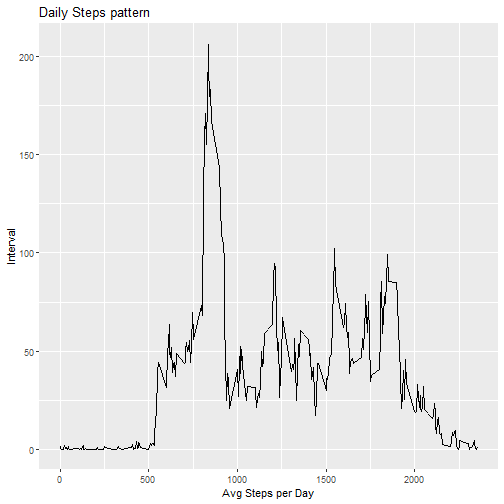
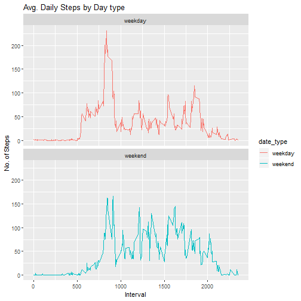

##Loading libraries

```r
library(ggplot2)
```

## Loading and preprocessing the data

```r
data <- read.csv('./repdata_data_activity/activity.csv')
```

# What is mean total number of steps taken per day?

## Calculate the total number of steps taken per day.
The following code shows the first 10 lines of the output

```r
steps_by_day <- aggregate(steps~date, data, sum)
head(steps_by_day,10)
```

```
##          date steps
## 1  2012-10-02   126
## 2  2012-10-03 11352
## 3  2012-10-04 12116
## 4  2012-10-05 13294
## 5  2012-10-06 15420
## 6  2012-10-07 11015
## 7  2012-10-09 12811
## 8  2012-10-10  9900
## 9  2012-10-11 10304
## 10 2012-10-12 17382
```
## Plot a histogram


```r
ggplot(steps_by_day, aes(x = steps)) + geom_histogram(binwidth = 1000) + labs(title = "Daily Steps Frequency", x = "Steps", y = "Count")
```



## Mean and median of total steps taken per day
Summary has all the quantile and the mean as well. We can pick the mean and median data from there

```r
summary(steps_by_day$steps)
```

```
##    Min. 1st Qu.  Median    Mean 3rd Qu.    Max. 
##      41    8841   10765   10766   13294   21194
```

## What is the average daily activity pattern?

```r
steps_by_interval <- aggregate(steps~interval, data, mean)
ggplot(steps_by_interval, aes(y = steps, x = interval)) + geom_line() + labs(title = "Daily Steps pattern", x = "Avg Steps per Day", y = "Interval")
```



## Which 5-minute interval, on average across all the days in the dataset, contains the maximum number of steps?

```r
steps_by_interval[steps_by_interval$steps == max(steps_by_interval$steps),]$interval
```

```
## [1] 835
```

# Imputing missing values

## Calculate and report the total number of missing values in the dataset (i.e. the total number of rows with 𝙽𝙰s)

```r
nrow(data[is.na(data$steps),])
```

```
## [1] 2304
```

## Devise a strategy for filling in all of the missing values in the dataset. The strategy does not need to be sophisticated. For example, you could use the mean/median for that day, or the mean for that 5-minute interval, etc. Create a new dataset that is equal to the original dataset but with the missing data filled in.

The idea is to impute the data to contain the average per interval return of all the non empty data

```r
data_wo_NA <- data[!is.na(data$steps),]
steps_by_interval <- aggregate(steps~interval, data_wo_NA, mean)
interval_vector<- sapply(data[is.na(data$steps),]$interval, function( c ) { steps_by_interval[ steps_by_interval$interval == c,]$steps } )
tidyData <- data
tidyData[is.na(tidyData$steps),]$steps <- interval_vector
```

## Make a histogram of the total number of steps taken each day and calculate and report the mean and median total number of steps taken per day. Do these values differ from the estimates from the first part of the assignment? What is the impact of imputing missing data on the estimates of the total daily number of steps?


```r
steps_by_day <- aggregate(steps~date, data, sum)
ggplot(steps_by_day, aes(x = steps)) + geom_histogram(binwidth = 1000) + labs(title = "Daily Steps Frequency", x = "Steps", y = "Count")
```


## Mean and median of total steps taken per day
Summary has all the quantile and the mean as well. We can pick the mean and median data from there

```r
summary(steps_by_day$steps)
```

```
##    Min. 1st Qu.  Median    Mean 3rd Qu.    Max. 
##      41    8841   10765   10766   13294   21194
```

# Are there differences in activity patterns between weekdays and weekends?

## Create a new factor variable in the dataset with two levels – “weekday” and “weekend” indicating whether a given date is a weekday or weekend day.

```r
tidyData$date_type <- c("weekday")
Weekend_vector <- weekdays(as.POSIXct(tidyData$date, format = "%Y-%m-%d")) %in% c("Saturday", "Sunday")
tidyData[Weekend_vector,]$date_type <- c("weekend")
head(tidyData,10)
```

```
##        steps       date interval date_type
## 1  1.7169811 2012-10-01        0   weekday
## 2  0.3396226 2012-10-01        5   weekday
## 3  0.1320755 2012-10-01       10   weekday
## 4  0.1509434 2012-10-01       15   weekday
## 5  0.0754717 2012-10-01       20   weekday
## 6  2.0943396 2012-10-01       25   weekday
## 7  0.5283019 2012-10-01       30   weekday
## 8  0.8679245 2012-10-01       35   weekday
## 9  0.0000000 2012-10-01       40   weekday
## 10 1.4716981 2012-10-01       45   weekday
```

## Make a panel plot containing a time series plot (i.e. type = "l"\color{red}{\verb|type = "l"|}type="l") of the 5-minute interval (x-axis) and the average number of steps taken, averaged across all weekday days or weekend days (y-axis). See the README file in the GitHub repository to see an example of what this plot should look like using simulated data.

```r
steps_by_interval_dt <- aggregate(steps~interval+date_type, tidyData, mean)
ggplot(steps_by_interval_dt , aes(x = interval , y = steps, color=date_type )) + geom_line() + labs(title = "Avg. Daily Steps by Day type", x = "Interval", y = "No. of Steps") + facet_wrap(.~date_type , ncol = 1, nrow=2)
```



